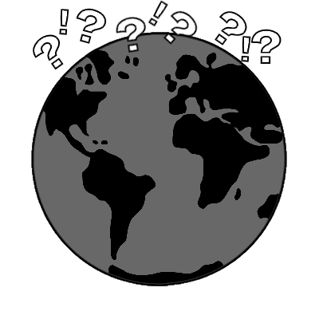

# Guess the Country (Game)

## Project Purpose

Random generated country guessing game, for users to test their geography skills. The game will have unlimited amounts of attempts to guess the country but will have a guess counter for the user to know how many attempts it took for them to get the correct answer.

The game will also have Green, and red indicators to show how close the user is. For example, if the user guesses "France" but the country is "Germany" a green indicator will show they are both in the same region.

## UX Design

index.html will have a basic introduction to the website explaing what the game is, and how it is played.

A navbar will be at the top of the webpage which will have links to a about, and game webpage.

1. btnStart - This will be a button which once pressed by the user will call a function to call the 'Rest Countries' API to
2. btnRestart restart the game pulling in a new random country.
3. btnSubmit - submits the players current guess. Incrementing the guess count if wrong or displaying correct answer if matching.

Here you can find a logo, and a favicon which I have designed, and made myself using an online platform called 'Photopea'.
These are the two designs I have created, both will be used throughout the website.

This is the favicon that I have designed which is just a smaller version of the logo created above.

## Call-to-Action

1. **New game/Start game** - generates random countries, and put this into an array.
2. **Restart game** - restarts the game is the user wishes to. Clears array, number of guesses, region etc.
3. **Submit** - Submits the user answer within the input field, and validates the guess against the answer.

## Testing & Implementation

Testing will be done with 'Jest' v.26.6.3 to ensure that the scripts I am implementing to my website work when the DOM has loaded to the page.

I will be testing using TDD method, this is what I find most comfortable when developing.

The first thing I will be testing is ensuring that values can be entered in a element by manipulating the DOM.

### Incrementing Guess

Incrementing guess will add '1' to the guess total for every incorrect entry put into the guess text box.

## Wireframes

Wireframes for the website can be found at '/Wiresframes'. Inside are two views, one for mobile, and the other for desktop/larger devices. Not much changes between the two as the website doesn't have a large amount of sections with content, the site is more to display my jaavscript, and use of API's.

## Deployment

Deployment will be done using GitHub pages feature.
