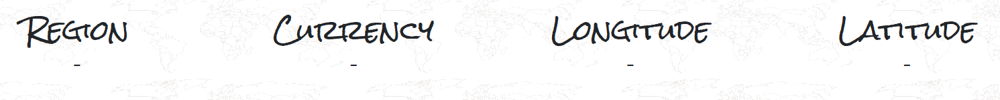
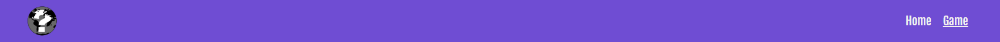

# Guess the Country (Game)

This is a random country guessing game designed to test your geography skills.

Game is designed to show my JavaScript ability with use of APIs.

Repository [Link](https://github.com/Djzngo/guess-the-country)

Live Site [Link](https://djzngo.github.io/guess-the-country/)

---

## Table of Contents

1. [Project Purpose](#project-purpose)
2. [User Experience (UX)](#user-experience-ux)
	1. [Strategy](#strategy)
	2. [Scope](#scope)
	3. [Structure](#structure)
	4. [Skeleton](#skeleton)
	5. [Surface](#surface)
3. [Features](#features)
4. [Technologies Used](#technology-used)
5. [Testing](#testing)
6. [Credits](#credits)

---

## Project Purpose

Random generated country guessing game, for users to test their geography skills. 
The game will have unlimited amounts of attempts to guess the country but will have a guess counter for the user to know how many attempts it took for them to get the correct answer.

The game with only being using Europe as its region. This is because the API I am using only allows you to pull 100 countries at a time.

## User Experience (UX)

### Strategy

#### Site Goals

- Fun game for user to test geography skills
- web-based application that uses JavaScript as its main language to function.

#### External User's Goals

- Somewhere for me to be able to test my knowledge on countries from around the world.

### User Stories

#### First-time visitor

1. I would like to be able to test my geography skills in a fun way, with a random generated guessing game.
2. It would be great to have clear explanation of how the game is played with any features that may unlock as you guess more.

#### Returning visitor

3. I would like to be able to see statistics of each time I have played the game.

### Scope

#### Features Included

| Feature | User Story | Rationale |
| --- | --- | --- |
| Main navigation | all | This serves to ensure that the user is able to quickly and easily access the page with the information they need. |
| Game page | All | Animated design to show the user that the game is running whenever they click a button.
| Indicators | 2 | As the user guesses to help some information about the country can be revealed at the users choice.
| Footer | All | Displays social media links which open in a new tab, promotes the business' other forms of media. |

### Structure

Site is built up with 2 pages, index.html, and game.html.

#### Site Map

##### Home

The home page of the website shows the logo of the website, has a small introduction to what the website is, and also a small guide on how the game is played along with the features unlocked during gameplay.

##### Game

Main page of the website as this is where the game is played.

- Start button
- Restart button
- Input field
- Indicators
- Guess count

### Skeleton

Wireframes for the general structure has been created for mobile, and desktop. They display the way the page should be structure andd where the content should go.

| Page | Desktop | Mobile
| --- | --- | --- |
| Home & Game | [Click me](wireframes/GTC%20Wireframe%20Desktop.png) | [Click me](wireframes/GTC%20Mobile%20View%20Wireframe.png) |

### Surface

##### Colour Scheme

The reason behind the colour choice is just simply my favourite colour is purple so I wanted to be the primary colour on the website.

| Colour | Hex |
| --- | --- |
| Primary colour | #6D4FD0 |
| Secondary colour | #F2F0EF |

##### Fonts

Two fonts have been used for creating this website, one for titles, and the other for main body text of web page.

| Font | Source |
| --- | --- |
| Fjalla One | [Link](https://fonts.google.com/specimen/Fjalla+One) |
| Rock Salt | [Link](https://fonts.google.com/specimen/Rock+Salt) |

---

## Features

### Implemented

#### Navbar

Navigation menu which allows user to navigate easily to each page of the website, responsive design so collapses on smaller screens.

---

## Technology Used

### Languages
- [HTML5](https://developer.mozilla.org/en-US/docs/Web/HTML)
- [CSS3](https://developer.mozilla.org/en-US/docs/Web/CSS)

### Frameworks, Libraries and Programs

| Tool | Used for |
|---|---|
| [Bootstrap 5.3.8](https://getbootstrap.com/) | Responsive grid, navigation component and form controls |
| [Google Fonts](https://fonts.google.com/) | Fredoka and Story Script |
| [REST Countries API](https://restcountries.com/) | Generating random countries from EUR |
| [Git](https://git-scm.com/) | Version control |
| [GitHub](https://github.com/) | Remote repository |
| [GitHub Pages](https://pages.github.com/) | Hosting the deployed site |
| [Visual Studio Code](https://code.visualstudio.com/) | IDE |
| [W3C Nu HTML Checker](https://validator.w3.org/) | Validating HTML |
| [W3C Jigsaw CSS Validator](https://jigsaw.w3.org/css-validator/) | Validating CSS |
| [Photopea](https://www.photopea.com/) | Creating any graphics on the website, including my wireframes for my website

---

## Testing

### Validator Results

| Page | HTML (W3C) |
| --- | --- |
| index.html | [Click me](assets/readme/index-validator.png) |
| game.html | [Click me](assets/readme/game-validator.png) |

[CSS Validation](assets/readme/css-validator.png)

### Manual Testing

| Feature | Test | Expected | Actual | Result |
|---|---|---|---|---|
| Main navigation | Clicked every navigation link from every page | The correct page loads each time | As expected | Pass |
| Current page indicator | Visited each page in turn | The current page is marked in the navigation | As expected | Pass |
| Navigation toggle | Responsive design, collapses on smaller screens | The toggle appears and the menu expands and collapses | As expected | Pass |
| Logo link | Clicked the logo from every page | Returns to the home page | As expected | Pass |
| External links | Clicked all threee social links | Each opens in a new tab, leaving the site open | As expected | Pass |
| Internal link | Link on index.html | leads to game.html page when clicked | As expected | Pass |
| Start game button | Click to start game | When pressed spinners should display as loading, and start game button should display: none | As expected | Pass
| Input field | Enter key for submit | User should be able to submit by pressing enter | As expected | Pass
Restart game button | Click button to restart game | This should select a new random country from the list generated, reset count. | As expected | Pass

### Responsive Testing

| Feature | Test | Expected | Actual | Result |
|---|---|---|---|---|
| Responsive navbar | Breakpoint test | navbar collapses when screen width is below 992px | As expected | Pass

---

## Credits

### Code
 
| Source | Used for | Location in project |
|---|---|---|
| [Bootstrap 5 documentation — Navbar](https://getbootstrap.com/docs/5.3/components/navbar/) | Responsive navigation bar structure and toggle. Some elements remove to align with the design of this website. | Header of all webpages |
| [Spinner](https://getbootstrap.com/docs/5.3/components/spinners/#about) | To show the user is action has been taken, and is being processed | game.html
| [Bootstrap 5](https://getbootstrap.com/) | Grid system, , and utility classes throughout | All pages |
| [jQuery](https://jquery.com/) | All the JS on this page | Game webpage |
| [Jest](https://jestjs.io/) | Testing code | within assets/scripts/tests folder |

### Content

All content writen on this website is all done by me.

Any graphics have been done by myself, if not they're credited in the next section of this doc.

### Media

| Assets | Creator | Source
|---|---|---|
| favicon.ico | Created by me | Created using 'Photopea'
| GTC-logo-two.png | Created by me | Created using 'Photopea'
| correct-tick.png | Free to use | www.magnific.com (Lincense: Free)
| incorrect-cross.png | Free to use | www.magnific.com (Lincense: Free)
| reaction-go.png | Free to use | www.magnific.com (Lincense: Free)
| unlock.png | Free to use | www.magnific.com (Lincense: Free)
| The_World_map.png | Free to use | https://commons.wikimedia.org/wiki/File:The_World_map.png